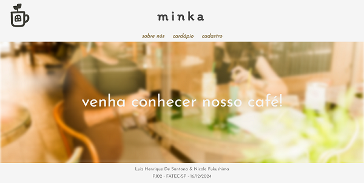
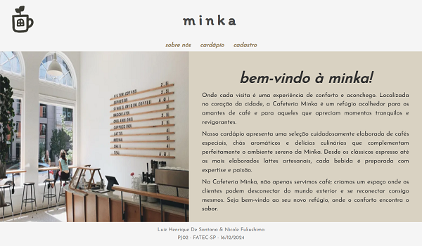
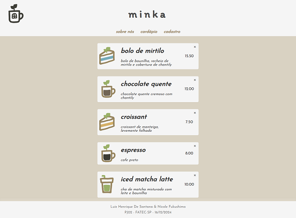
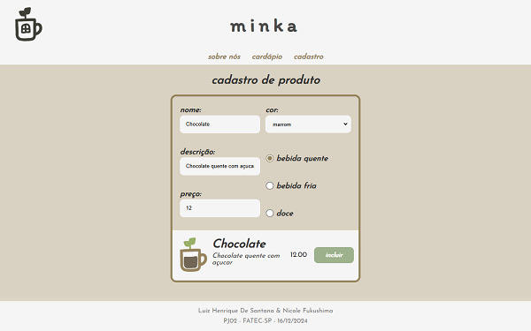

# Minka Coffee Website

Bem-vindo ao **Minka Coffee**, um site desenvolvido para divulgar a cafeteria Minka, apresentar seu cardápio, e permitir o cadastro e exclusão de produtos de forma eficiente.

## 📝 Descrição

O site tem como objetivo proporcionar uma experiência agradável para os visitantes e facilitar a gestão do cardápio da cafeteria. Aqui estão as principais funcionalidades:

- **Página de divulgação**: Apresenta informações sobre a cafeteria e seus valores, destacando o ambiente acolhedor e o cardápio exclusivo.
- **Cardápio interativo**: Lista os produtos disponíveis na cafeteria com imagens e descrições detalhadas.
- **Sistema de gestão de produtos**: Permite o cadastro, edição e exclusão de produtos do cardápio.


## 🚀 Funcionalidades

1. **Página Inicial**:
   - Introdução à cafeteria com informações gerais e link para o cardápio.

2. **Cardápio**:
   - Apresenta os produtos disponíveis com imagens e descrições.

3. **Cadastro de Produtos**:
   - Um formulário permite adicionar novos itens ao cardápio.

4. **Exclusão de Produtos**:
   - Produtos podem ser removidos através do painel de administração.

## 🛠️ Tecnologias Utilizadas

- **Frontend**:
  - HTML5, CSS3
  - JavaScript
- **Backend**:
  - PHP 8+
  - MySQL
- **Servidor**:
  - XAMPP para ambiente local

## 🚀 Como Configurar e Executar

### 1️⃣ Pré-requisitos
- PHP 8.0 ou superior.
- Servidor local como [XAMPP](https://www.apachefriends.org/).
- MySQL ou MariaDB.

### 2️⃣ Clonar o Repositório
Clone o projeto em seu ambiente local:
```bash 
git clone https://github.com/seu-usuario/minka-coffee.git
cd minka-coffee
```
### 3️⃣ Configurar o Banco de Dados
O script PHP responsável pela criação do banco de dados (`php/database/database.php`) já verifica se o banco existe. Basta rodá-lo no navegador:

1. Copie o projeto para o diretório `htdocs` do XAMPP.
2. Acesse o arquivo no navegador: 

    `http://localhost/minka-coffee/php/database/database.php`
3. O banco de dados `minka_db` será criado automaticamente.

### 4️⃣ Configuração Manual (Opcional)

Se necessário, edite o arquivo `php/database/conectar.php` para ajustar os parâmetros de conexão:

```php
$host = "localhost";
$user = "root";
$pass = "";
$db   = "minka_db";
```

### 5️⃣ Acessar o Site
Abra o navegador e acesse:
`http://localhost/minka-coffee`

## 📸 Screenshots

### **Página 'Home'**
  

### **Página 'Sobre'**
  

### **Cardápio**
  

### **Cadastro**
  

## 🔧 Melhorias Futuras

- Adicionar autenticação de usuários para acesso ao painel administrativo.
- Implementar categorias e filtros no cardápio.
- Funcionalidade de busca no banco de dados.


## 🧾 Licença

Este projeto está licenciado sob a [MIT License](LICENSE).  
Sinta-se à vontade para usá-lo e modificá-lo conforme necessário.

## 🏆 Créditos

Este projeto foi desenvolvido durante a disciplina de Desenvolvimento Web por:

- [Luiz Henrique de Santana](https://github.com/Dev-Luiz-Henrique)
- [Nicole Carvalho Fukushima](https://github.com/nicolefukushima)

## 📩 Contato

Dúvidas ou sugestões? Entre em contato:

- **E-mail**: dev-luizhenrique@outlook.com
